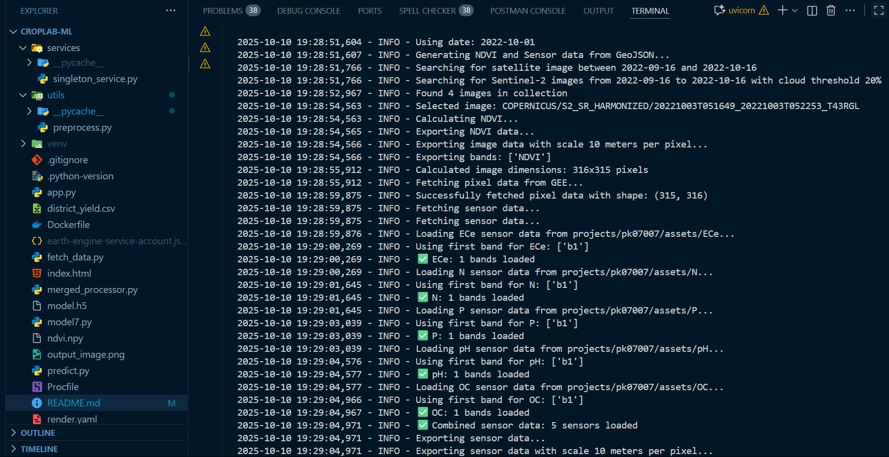
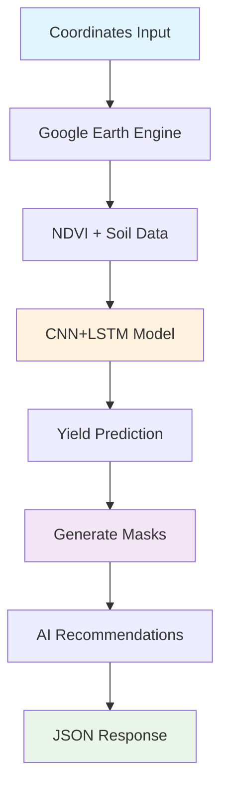

# 🤖 CropLab-ML: Deep Dive Technical Analysis

## 🌾 Overview

CropLab-ML is an advanced machine learning API that predicts crop yields using satellite imagery (NDVI) and soil sensor data. The system combines Google Earth Engine satellite data processing with deep learning models to provide accurate crop yield predictions and visual heatmaps.

## 🚀 Key Features

- **Real-time Crop Yield Prediction**: CNN+LSTM models with NDVI and soil data
- **Visual Heatmap Generation**: Color-coded crop health maps
- **Google Earth Engine Integration**: Automatic satellite data processing
- **Multi-sensor Analysis**: 5 soil parameters (ECe, N, P, pH, OC)
- **Location Intelligence**: District-specific insights and recommendations

---

## 🔥 API Call in Action

<!-- Terminal/Backend Processing Image -->


*Live terminal output showing the ML pipeline processing satellite data and generating crop health analysis*

---

## 🔄 Simplified ML Pipeline



## 📊 Core Technology Stack

### Data Processing
- **Google Earth Engine**: Satellite imagery and geospatial data
- **NDVI Calculation**: (NIR - Red) / (NIR + Red) vegetation index
- **Soil Sensors**: ECe, N, P, pH, OC parameters

### Machine Learning
- **Model**: Hybrid CNN+LSTM architecture
- **Input**: NDVI (315×316) + Soil data (315×316×5)
- **Output**: Yield prediction + pixel classification
- **Fallback**: Robust error handling with default models

### Visualization
- **Color Coding**: Red (stressed), Yellow (moderate), Green (healthy)
- **Thresholds**: t1=0.5, t2=0.75 (customizable)
- **Output**: Base64 encoded PNG masks for web display

---

## 🎯 API Response Structure

```json
{
  "predicted_yield": 4.31,
  "old_yield": 4.75,
  "growth": {"ratio": 0.91, "percentage": -9.16},
  "location": {
    "district": "moga",
    "coordinates": {"latitude": 30.686, "longitude": 74.954}
  },
  "masks": {
    "red_mask_base64": "...",
    "yellow_mask_base64": "...", 
    "green_mask_base64": "..."
  },
  "pixel_counts": {"valid": 99540, "red": 2785, "yellow": 15194, "green": 81561},
  "suggestions": {
    "overall_assessment": "⚠️ Average. Some areas need improvement.",
    "field_management": ["🟢 Most field looks healthy..."],
    "soil_recommendations": ["🧪 Soil is alkaline — use gypsum..."],
    "immediate_actions": ["✅ No urgent action required..."]
  }
}
```

---

## 🛠️ Technical Implementation

### Model Architecture
- **Multi-input**: NDVI + soil sensor data
- **Spatial Processing**: CNN layers for pattern recognition
- **Temporal Analysis**: LSTM for seasonal variations
- **Output**: Single yield value + pixel classifications

### Performance
- **NDVI Data Fetch**: ~2-5 seconds
- **Model Inference**: ~100-500ms
- **Heatmap Generation**: ~1-3 seconds
- **Total Pipeline**: ~5-10 seconds

### Deployment
- **FastAPI**: High-performance Python framework
- **TensorFlow**: ML model inference
- **Docker**: Containerized deployment
- **Render**: Cloud hosting platform

---

## 🌱 Real-World Impact

- **Precision Agriculture**: Target problem areas for intervention
- **Resource Optimization**: Reduce fertilizer and water waste
- **Yield Forecasting**: Better harvest planning and market strategies
- **Early Warning**: Detect crop stress before visible symptoms

---

*This technical deep-dive showcases the sophisticated ML pipeline powering our agricultural intelligence platform.*
