# 🌾 CropLab - AI-Powered Crop Health Prediction and Monitoring System

<!-- Cover Image: Main project output showing satellite analysis -->
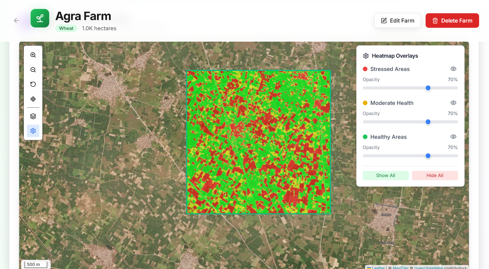

## 🚀 Overview

CropLab is an innovative agricultural technology solution that leverages satellite imagery, artificial intelligence, and machine learning to provide farmers with real-time crop health monitoring, yield predictions, and actionable farming insights. Our platform combines cutting-edge remote sensing technology with user-friendly interfaces to make precision agriculture accessible to farmers of all scales.

## ✨ Features

- **🛰️ Satellite-Based Analysis**: Real-time crop health monitoring using satellite imagery
- **🤖 AI-Powered Predictions**: Machine learning models for yield prediction and risk assessment
- **📊 Interactive Dashboards**: Comprehensive visualization of farm data and analytics
- **🔔 Smart Notifications**: Automated alerts for crop health issues and farming recommendations
- **📱 Multi-Device Access**: Seamless experience across desktop, tablet, and mobile devices
- **🗺️ Interactive Mapping**: Detailed farm boundary mapping with overlay visualizations
- **📈 Historical Analysis**: Track farm performance and trends over time
- **🌱 Guest Mode**: Try the platform without registration for immediate access

## 🚀 Getting Started

### Guest Mode Experience

New users can immediately start exploring the platform without any registration required. The guest mode provides full access to farm creation and analysis features, making it easy to evaluate the platform's capabilities.

<!-- Image: Landing page with guest mode access -->
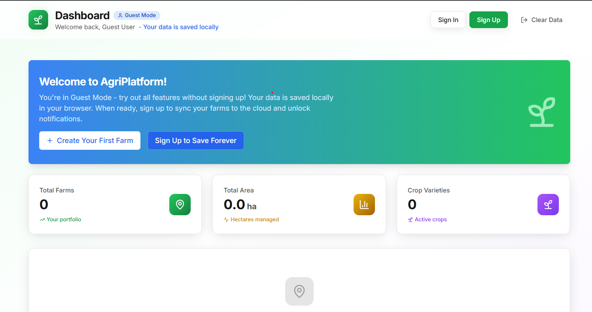

## 👤 User Journey

### 1. Farm Creation

Users begin their journey by creating a farm profile. The intuitive interface guides them through the process of defining farm boundaries and basic information.

<!-- Image: Create farm button highlighting -->
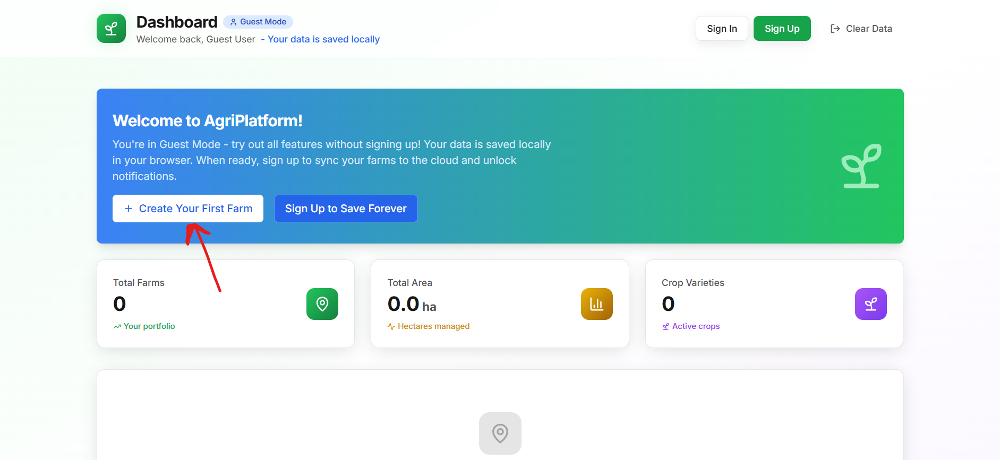

#### Step-by-Step Farm Setup

<!-- Image: Farm creation form showing fields -->
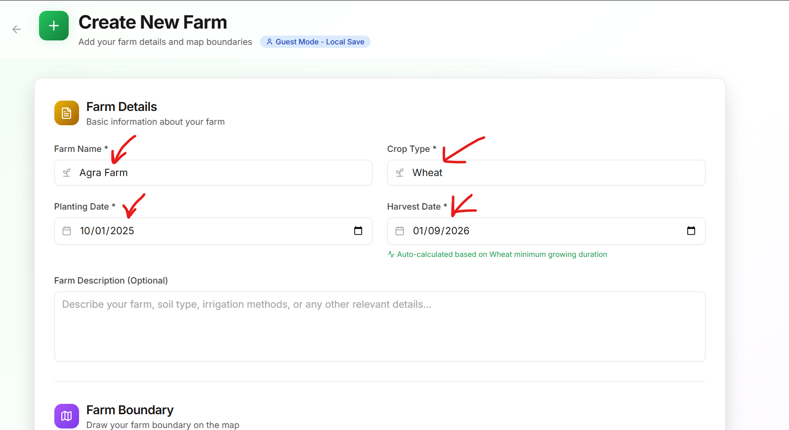

<!-- Image: Map interface for drawing farm boundaries -->
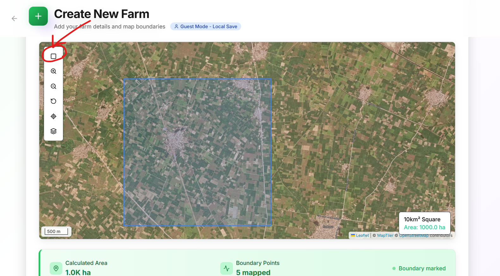

The farm creation process involves:
- **Basic Information**: Farm name, crop type, planting and harvest dates
- **Boundary Definition**: Interactive map tool for precise boundary drawing
- **Area Calculation**: Automatic calculation of farm area in hectares
- **Location Services**: GPS-based location detection and address resolution

### 2. AI Analysis in Progress

Once a farm is created, our AI engines immediately begin processing satellite data to generate comprehensive crop health analysis.

<!-- Image: Analysis in progress with loading states -->
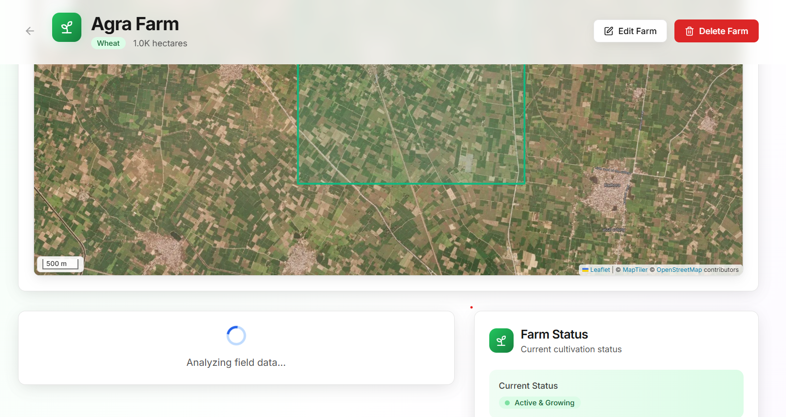

The analysis includes:
- **NDVI Processing**: Normalized Difference Vegetation Index calculation
- **Health Segmentation**: Classification of crop areas into healthy, moderate, and stressed zones
- **Yield Prediction**: ML-based yield forecasting using historical and current data
- **Risk Assessment**: Identification of potential issues and stress factors

### 3. Comprehensive Results

<!-- Image: Detailed analysis results with masks and suggestions -->


<!-- Image: Farm detail page with overlays and controls -->
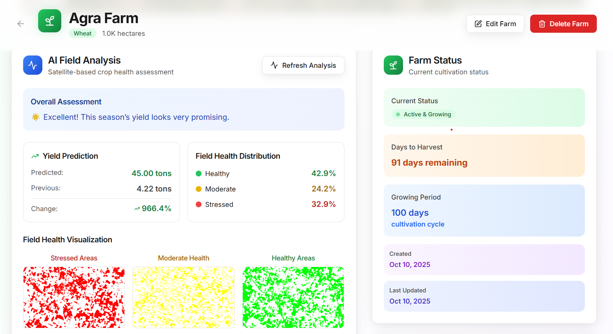

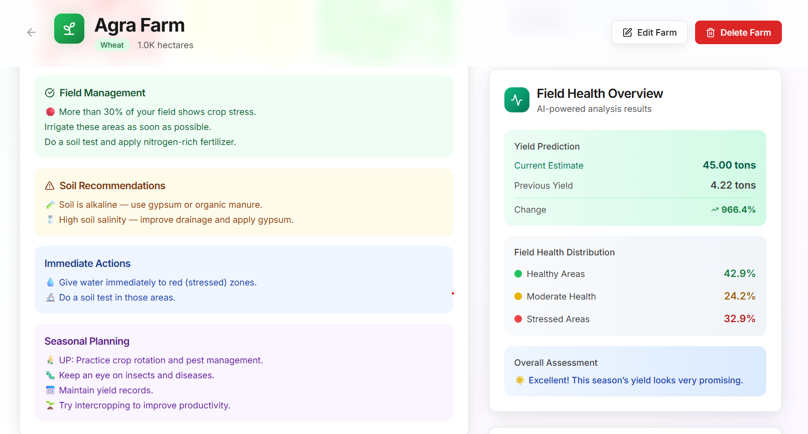

### 📊 API Response Structure

Our `generate_heatmap` API returns comprehensive analysis data in the following JSON format:

```json
{
  "predicted_yield": 4.314789772033691,
  "old_yield": 4.75,
  "growth": {
    "ratio": 0.9083767941123561,
    "percentage": -9.162320588764391
  },
  "location": {
    "district": "moga",
    "coordinates": {
      "latitude": 30.686323800000004,
      "longitude": 74.95473419999999
    },
    "complete_address": "Bagha Purana Tahsil, Moga, Punjab, India"
  },
  "ndvi_shape": [315, 316],
  "sensor_shape": [315, 316, 5],
  "masks": {
    "red_mask_base64": "mask in base64",
    "yellow_mask_base64": "mask in base64",
    "green_mask_base64": "mask in base64"
  },
  "pixel_counts": {
    "valid": 99540,
    "red": 2785,
    "yellow": 15194,
    "green": 81561
  },
  "thresholds": {
    "t1": 0.5,
    "t2": 0.75
  },
  "suggestions": {
    "overall_assessment": "⚠️ Average. Some areas need improvement.",
    "yield_analysis": {
      "predicted_yield": 4.31,
      "previous_yield": 4.75,
      "yield_change": -0.44,
      "yield_change_percent": -9.2,
      "status": "Lower"
    },
    "field_management": [
      "🟢 Great! Most of your field looks healthy.",
      "Keep following your current farming practices."
    ],
    "soil_recommendations": [
      "🧪 Soil is alkaline — use gypsum or organic manure.",
      "🧂 High soil salinity — improve drainage and apply gypsum."
    ],
    "immediate_actions": [
      "✅ No urgent action required — continue regular monitoring."
    ],
    "seasonal_planning": [
      "🌾 Punjab: Plan better wheat-rice rotation.",
      "💧 Prepare for water management before monsoon.",
      "📅 Maintain yield records.",
      "🌱 Try intercropping to improve productivity."
    ],
    "risk_alerts": [
      "✅ No major problems detected — field is in good condition."
    ]
  }
}
```

For detailed technical implementation and ML model analysis, see our [Deep Dive Technical Documentation](./GENERATE_HEATMAP.md).

## 🔄 Technology Flow

### System Architecture Flowchart

<!-- Image: Architecture flowchart from PDF -->
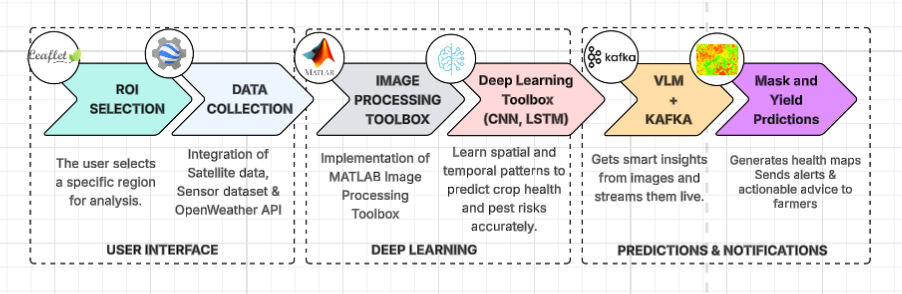

### Data Processing Pipeline

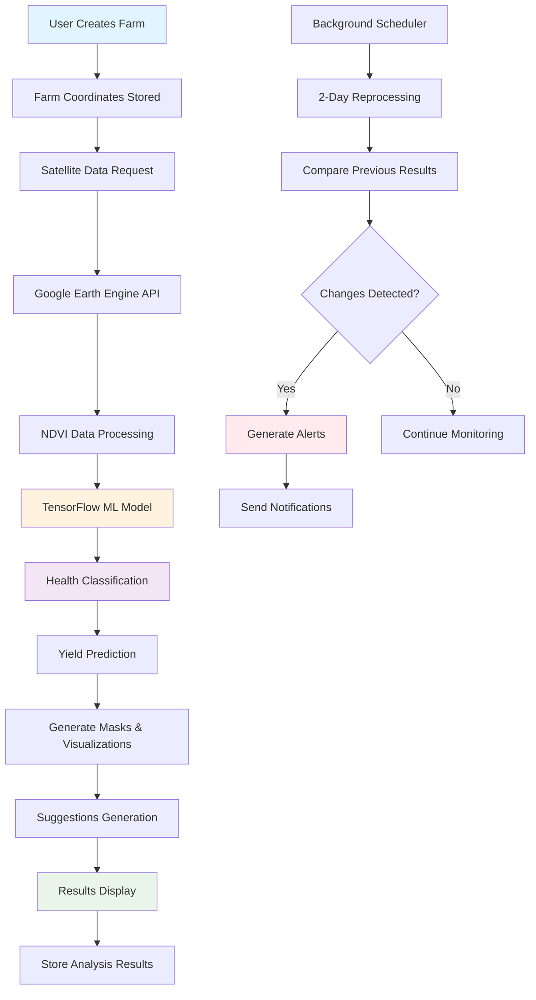

### Technical Processing Flow

1. **Data Acquisition**: Satellite imagery retrieval from Google Earth Engine
2. **Preprocessing**: Image normalization and coordinate transformation
3. **NDVI Calculation**: Vegetation index computation for health assessment
4. **ML Processing**: TensorFlow model inference for pattern recognition
5. **Classification**: Pixel-level health categorization (Red/Yellow/Green zones)
6. **Prediction**: Yield forecasting based on current conditions
7. **Visualization**: Mask generation and overlay creation
8. **Insights**: AI-generated recommendations and action items

## 🔐 User Authentication & Continuous Monitoring

### Enhanced Features for Registered Users

While guest mode provides full analytical capabilities, registered users unlock additional premium features:

#### 🔔 Smart Notification System
- **Real-time Alerts**: Immediate notifications for critical crop health changes
- **Scheduled Monitoring**: Automated farm reprocessing every 2 days
- **Multi-channel Delivery**: Email, SMS, and in-app notifications
- **Custom Thresholds**: Personalized alert settings based on crop and season

#### 📱 Cross-Device Synchronization
- **Cloud Storage**: Farm data synchronized across all devices
- **Offline Access**: Download reports for offline viewing
- **Collaborative Features**: Share farm insights with team members
- **Historical Tracking**: Long-term trend analysis and performance metrics

#### 🔄 Automated Monitoring Cycle

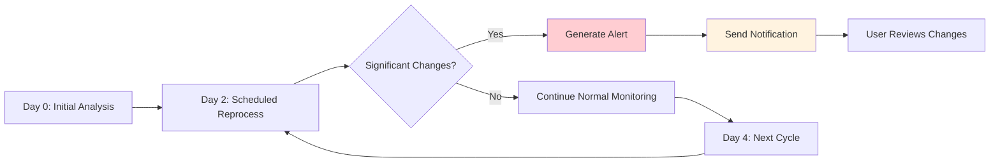

## 🎯 Key Benefits

### For Farmers
- **Early Problem Detection**: Identify crop stress before visible symptoms appear
- **Optimized Resource Use**: Targeted interventions reduce waste and costs
- **Yield Maximization**: Data-driven decisions for better harvest outcomes
- **Risk Mitigation**: Proactive management of potential crop issues

### For Agricultural Consultants
- **Scalable Monitoring**: Manage multiple farms from a single dashboard
- **Evidence-Based Advice**: Satellite data supports recommendations
- **Client Reporting**: Professional reports with visual evidence
- **Efficiency Gains**: Reduce field visits through remote monitoring

### For Agricultural Organizations
- **Regional Monitoring**: Track crop health across large areas
- **Policy Support**: Data-driven insights for agricultural planning
- **Research Applications**: Historical data for agricultural research
- **Resource Allocation**: Optimize support based on actual needs

## 🛠️ Technology Stack

### Frontend
- **React**: Modern UI framework for building interactive user interfaces
- **TypeScript**: Type-safe development for better code quality
- **MongoDB**: Document-based database for flexible data storage
- **Leaflet**: Interactive mapping and geospatial visualization
- **Vite**: Fast development and build tooling

### Backend
- **Node.js**: JavaScript runtime for server-side development
- **Express.js**: Web framework for API development
- **Kafka**: Distributed streaming platform for real-time data processing
- **JWT**: Secure authentication and authorization

### AI/ML Services
- **MATLAB**: Advanced mathematical computing and algorithm development
- **TensorFlow**: Machine learning model training and inference
- **Python**: Core language for AI/ML processing
- **Numpy**: Numerical computing library
- **Pandas**: Data manipulation and analysis tools
- **Matplotlib**: Visualization library for data representation
- **SciPy**: Scientific computing module for advanced algorithms
- **Azure Functions**: Serverless compute service for AI functions
- **AWS Lambda**: Serverless execution environment for AI tasks

### Data Sources
- **Google Earth Engine**: Satellite imagery and geospatial data
- **OpenWeather**: For Weather data integration


## 📦 Installation

### Prerequisites
- Node.js 18+ and npm
- Python 3.8+ and pip
- MongoDB (local or Atlas)
- Google Earth Engine account

### Quick Start

1. **Clone the repository**
   ```bash
   git clone https://github.com/Pratham2703005/CropLab.git
   cd CropLab
   ```

2. **Install Frontend Dependencies**
   ```bash
   cd Frontend
   npm install
   npm run dev
   ```

3. **Install Backend Dependencies**
   ```bash
   cd ../Backend
   npm install
   npm run dev
   ```

4. **Setup AI Service**
   ```bash
   NOT HOSTED YET, so apologies!!
   ```

5. **Environment Configuration**
   ```bash
   # Backend .env
   MONGODB_URI=your_mongodb_connection_string
   JWT_SECRET=your_jwt_secret
   
   # AI Service .env
   GOOGLE_APPLICATION_CREDENTIALS=path_to_service_account.json
   ```

## 📚 API Documentation

### Core Endpoints

#### Farm Management
- `GET /api/farms` - Retrieve user farms
- `POST /api/farms` - Create new farm
- `PUT /api/farms/:id` - Update farm details
- `DELETE /api/farms/:id` - Delete farm

#### Analysis Services
- `POST /generate_heatmap` - Generate crop health analysis
- `GET /api/farms/:id/history` - Retrieve analysis history
- `POST /api/farms/:id/predict` - Get yield predictions

#### User Management
- `POST /api/auth/register` - User registration
- `POST /api/auth/login` - User authentication
- `GET /api/auth/profile` - User profile data

### WebSocket Events
- `farm_analysis_complete` - Real-time analysis updates
- `alert_generated` - Immediate alert notifications
- `monitoring_update` - Scheduled monitoring results

## 👥 Our Team

Meet the dedicated team behind CropLab - passionate developers, data scientists, and agricultural technology enthusiasts working together to revolutionize farming through AI and satellite technology.

<div align="center">

### 🚀 Core Development Team

| Name | Role | LinkedIn |
|------|------|----------|
| **Madhav Chaturvedi(Cap)** | Full Stack Dev | [](https://www.linkedin.com/in/madhavxchaturvedi/) |
| **Nauman Hussain** | Backend Dev | [](https://www.linkedin.com/in/nauman-hussain-a89297262/) |
| **Shikher Jain** | AI/ML Engineer | [](https://www.linkedin.com/in/shikher-jain-0bb8a8259) |
| **Aleena Khan** | Frontend Dev | [](https://www.linkedin.com/in/aleenakhan-/) |
| **Sheeba Salim** | AI/ML Engineer | [](https://www.linkedin.com/in/sheeba-salim-aa59051a5/) |
| **Aqsa Mushir** | AI/ML Engineer | [](https://www.linkedin.com/in/aqsa-mushir-176a0330b/ ) |
| **Me** | Full Stack Dev | [](https://www.linkedin.com/in/pratham-kumar-a6b672275/) |

</div>

### 🌟 Team Contributions

- **🔬 Research & Development**: Extensive research in precision agriculture and satellite data analysis
- **💻 Technical Implementation**: Full-stack development with modern technologies and best practices
- **🤖 AI/ML Innovation**: Advanced machine learning models for crop yield prediction and health analysis
- **🎨 User Experience**: Intuitive design and seamless user interface for farmers and agricultural consultants
- **☁️ Infrastructure**: Scalable cloud deployment and robust system architecture
- **📊 Data Engineering**: Efficient processing of satellite imagery and agricultural datasets

*Our diverse team combines expertise in computer science, agricultural engineering, data science, and user experience design to create impactful solutions for sustainable agriculture.*

## 🙏 Acknowledgments

- Google Earth Engine for satellite imagery access
- TensorFlow team for machine learning frameworks
- Agricultural research communities for domain expertise
- Open source contributors and maintainers

---

**Built with ❤️ for sustainable agriculture and food security**
